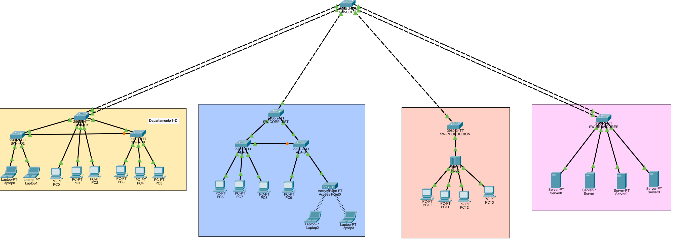
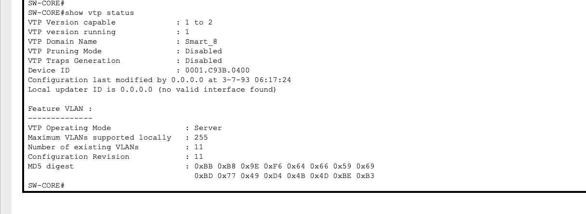
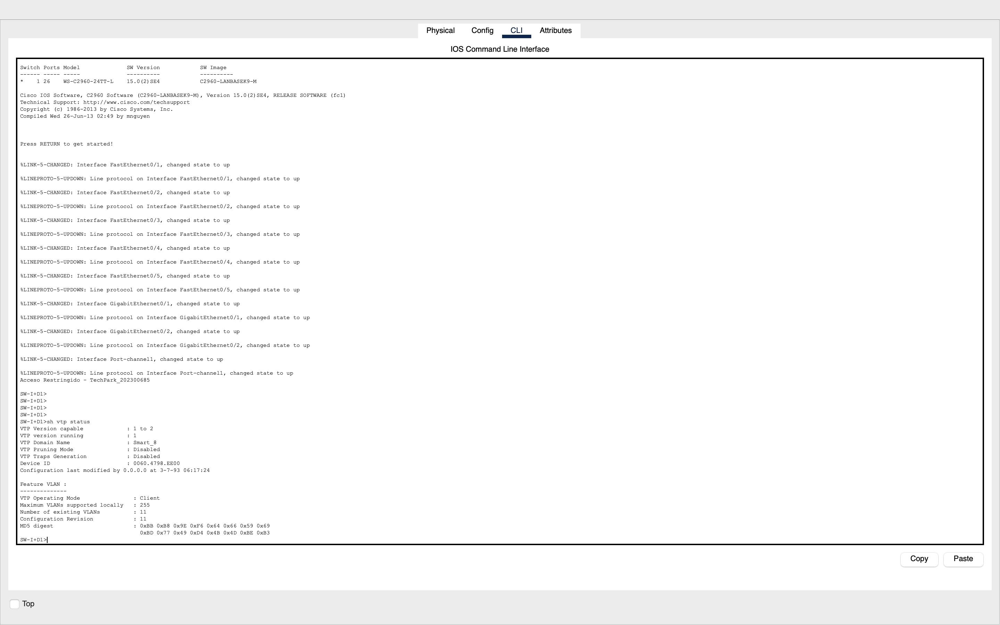
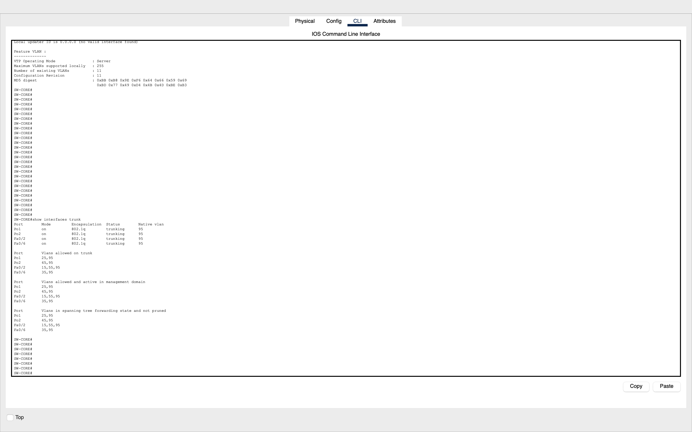
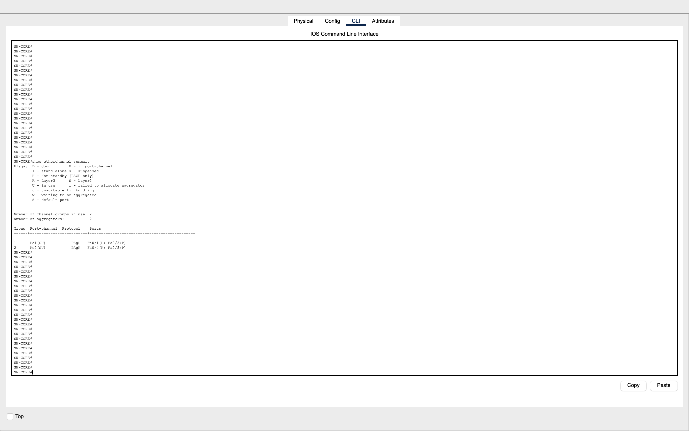
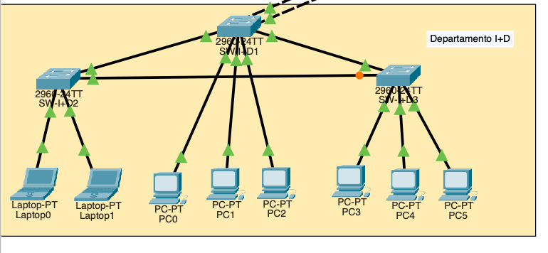
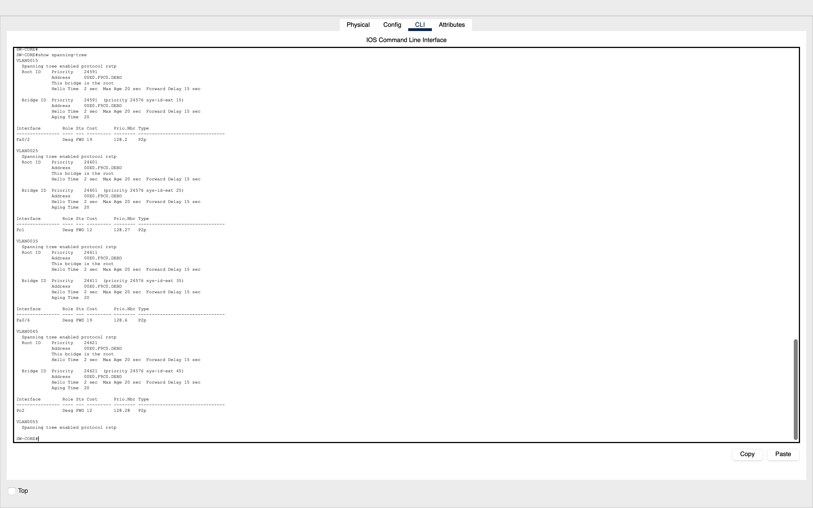
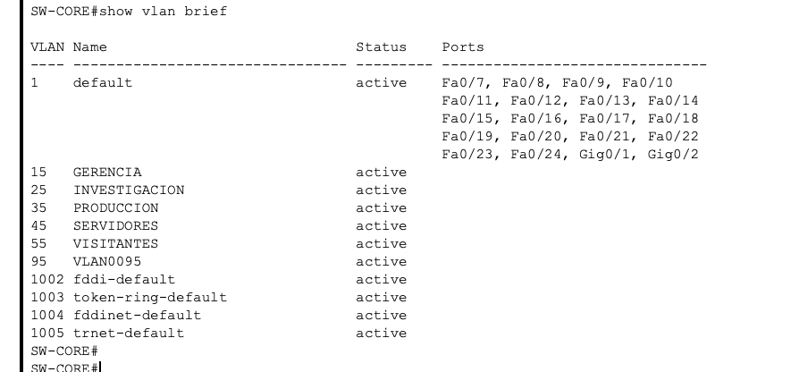

# Proyecto 1 - SmartCity Tech Park

## Redes de Computadoras 1

**Universidad de San Carlos de Guatemala**  
**Facultad de Ingeniería**  
**Ingeniería en Ciencias y Sistemas**

---

### Datos del estudiante

- **Proyecto:** SmartCity Tech Park
- **Nombre:** Astrid Vanesa Kim Ortiz
- **Carné:** 202300685
- **Curso:** Redes de Computadoras 1
- **Semestre:** Segundo Semestre 2026
- **Herramienta utilizada:** Cisco Packet Tracer

---

# 1. Introducción

El proyecto **SmartCity Tech Park** consiste en el diseño e implementación de una red LAN corporativa utilizando principalmente conceptos correspondientes a las capas 1 y 2 del modelo OSI.

La red fue dividida en diferentes áreas de trabajo con el objetivo de evitar una red completamente plana y separar correctamente el tráfico mediante VLANs.

Para lograrlo se utilizaron tecnologías como:

- VLANs.
- VTP.
- Enlaces Trunk.
- Rapid-PVST.
- EtherChannel mediante PAgP.
- Access Points.
- Segmento Legacy mediante HUB.
- Redundancia física entre switches.

El diseño busca garantizar conectividad entre dispositivos pertenecientes a una misma VLAN y mantener aislamiento entre dispositivos pertenecientes a VLANs diferentes.

No se implementó routing inter-VLAN, ya que el proyecto se enfoca principalmente en Capa 1 y Capa 2.

---

# 2. Objetivos

## 2.1 Objetivo general

Diseñar e implementar una red jerárquica para el complejo tecnológico SmartCity Tech Park utilizando tecnologías de conmutación de Capa 2 que permitan segmentación, redundancia y administración centralizada de VLANs.

## 2.2 Objetivos específicos

- Implementar una topología jerárquica utilizando un switch central.
- Separar los departamentos mediante VLANs.
- Administrar las VLANs mediante VTP.
- Configurar enlaces troncales entre switches.
- Utilizar una VLAN nativa diferente de VLAN 1.
- Implementar redundancia mediante EtherChannel.
- Utilizar Rapid-PVST para prevenir loops.
- Proporcionar redundancia en el Centro de I+D.
- Proporcionar redundancia en el Edificio Corporativo.
- Implementar un segmento Legacy utilizando un HUB.
- Proporcionar conectividad inalámbrica a visitantes.
- Mantener aislamiento entre VLANs.
- Comprobar conectividad intra-VLAN mediante pruebas de ping.

---

# 3. Parámetros determinados por el carné

El número de carné utilizado es:

```text
202300685
```

Los valores importantes son:

- Último dígito: **5**
- Penúltimo dígito: **8**
- El carné termina en un número **impar**.

Por lo tanto, los parámetros correspondientes al proyecto son:

| Parámetro | Configuración |
|---|---|
| Dominio VTP | Smart_8 |
| Contraseña VTP | proyecto12S2026 |
| EtherChannel | PAgP |
| STP | Rapid-PVST |
| VLAN nativa | 95 |
| Banner | Acceso Restringido - TechPark_202300685 |

---

# 4. Topología implementada

La red fue dividida en las siguientes áreas:

1. Centro de Datos / Core.
2. Centro de Investigación y Desarrollo.
3. Edificio Corporativo.
4. Planta de Producción.
5. Área de Servidores.

El switch `SW-CORE` funciona como punto central de la red.

Desde este dispositivo se distribuye la conectividad hacia los switches principales de cada una de las áreas.

## Topología completa



---

# 5. VLANs utilizadas

Las VLANs utilizadas fueron determinadas a partir del último dígito del carné.

| VLAN | Nombre | Área |
|---:|---|---|
| 15 | GERENCIA | Edificio Corporativo |
| 25 | INVESTIGACION | Centro de I+D |
| 35 | PRODUCCION | Planta de Producción |
| 45 | SERVIDORES | Centro de Datos |
| 55 | VISITANTES | Edificio Corporativo |
| 95 | VLAN nativa | Enlaces Trunk |

Las VLANs fueron creadas inicialmente en `SW-CORE`, que funciona como VTP Server.

Posteriormente fueron distribuidas hacia los demás switches configurados como VTP Client.

---

# 6. VTP

## 6.1 Configuración utilizada

El dominio utilizado fue:

```text
Smart_8
```

Contraseña:

```text
proyecto12S2026
```

El switch encargado de administrar las VLANs es:

```text
SW-CORE
```

Configurado como:

```text
VTP Server
```

Los demás switches de la red fueron configurados principalmente como:

```text
VTP Client
```

## 6.2 Justificación

Se seleccionó `SW-CORE` como VTP Server porque se encuentra en el Centro de Datos y funciona como punto central de la red.

Centralizar la creación de VLANs permite evitar que sea necesario crear manualmente cada VLAN en todos los switches.

Por ejemplo, la VLAN:

```text
25 INVESTIGACION
```

se creó únicamente en `SW-CORE` y posteriormente fue aprendida por los switches de I+D mediante VTP.

## Evidencia

```text
show vtp status
```




```text
show vtp status
```



---

# 7. Tabla de dispositivos y roles

| Dispositivo | Área | Rol | VTP |
|---|---|---|---|
| SW-CORE | Centro de Datos | Core | Server |
| SW-SERVIDORES | Centro de Datos | Acceso de servidores | Client |
| SW-I+D1 | Investigación | Distribución | Client |
| SW-I+D2 | Investigación | Acceso | Client |
| SW-I+D3 | Investigación | Acceso | Client |
| SW-CORP-DIST | Corporativo | Distribución | Client |
| ALA-A | Corporativo | Acceso | Client |
| ALA-B | Corporativo | Acceso | Client |
| SW-PRODUCCION | Producción | Distribución/Acceso | Client |
| AccessPoint-PT | Visitantes | Acceso inalámbrico | No aplica |
| HUB | Producción | Segmento Legacy | No aplica |

---

# 8. Asignación de puertos

## 8.1 SW-CORE

| Puerto | Conectado a | Tipo |
|---|---|---|
| Fa0/1 | SW-I+D1 Fa0/5 | EtherChannel Po1 / Trunk |
| Fa0/3 | SW-I+D1 Fa0/4 | EtherChannel Po1 / Trunk |
| Fa0/2 | SW-CORP-DIST Fa0/1 | Trunk |
| Fa0/6 | SW-PRODUCCION Fa0/2 | Trunk |
| Fa0/4 | SW-SERVIDORES Fa0/6 | EtherChannel Po2 / Trunk |
| Fa0/5 | SW-SERVIDORES Fa0/5 | EtherChannel Po2 / Trunk |

---

## 8.2 SW-SERVIDORES

| Puerto | Conectado a | Tipo | VLAN |
|---|---|---|---|
| Fa0/1 | Server0 | Access | 45 |
| Fa0/2 | Server1 | Access | 45 |
| Fa0/3 | Server2 | Access | 45 |
| Fa0/4 | Server3 | Access | 45 |
| Fa0/5 | SW-CORE Fa0/5 | EtherChannel Po2 / Trunk | 45,95 |
| Fa0/6 | SW-CORE Fa0/4 | EtherChannel Po2 / Trunk | 45,95 |

---

## 8.3 SW-I+D1

| Puerto | Conectado a | Tipo | VLAN |
|---|---|---|---|
| Fa0/1 | PC0 | Access | 25 |
| Fa0/2 | PC1 | Access | 25 |
| Fa0/3 | PC2 | Access | 25 |
| Fa0/4 | SW-CORE Fa0/3 | EtherChannel Po1 / Trunk | 25,95 |
| Fa0/5 | SW-CORE Fa0/1 | EtherChannel Po1 / Trunk | 25,95 |
| Gi0/1 | SW-I+D2 Gi0/1 | Trunk | 25,95 |
| Gi0/2 | SW-I+D3 Gi0/1 | Trunk | 25,95 |

---

## 8.4 SW-I+D2

| Puerto | Conectado a | Tipo | VLAN |
|---|---|---|---|
| Fa0/1 | Laptop | Access | 25 |
| Fa0/2 | Laptop | Access | 25 |
| Gi0/1 | SW-I+D1 Gi0/1 | Trunk | 25,95 |
| Gi0/2 | SW-I+D3 Gi0/2 | Trunk | 25,95 |

---

## 8.5 SW-I+D3

| Puerto | Conectado a | Tipo | VLAN |
|---|---|---|---|
| Fa0/1 | PC | Access | 25 |
| Fa0/2 | PC | Access | 25 |
| Fa0/3 | PC | Access | 25 |
| Gi0/1 | SW-I+D1 Gi0/2 | Trunk | 25,95 |
| Gi0/2 | SW-I+D2 Gi0/2 | Trunk | 25,95 |

---

## 8.6 SW-CORP-DIST

| Puerto | Conectado a | Tipo | VLAN |
|---|---|---|---|
| Fa0/1 | SW-CORE Fa0/2 | Trunk | 15,55,95 |
| Gi0/1 | ALA-A Gi0/1 | Trunk | 15,55,95 |
| Gi0/2 | ALA-B Gi0/1 | Trunk | 15,55,95 |

---

## 8.7 ALA-A

| Puerto | Conectado a | Tipo | VLAN |
|---|---|---|---|
| Fa0/1 | PC Gerencia | Access | 15 |
| Fa0/2 | PC Gerencia | Access | 15 |
| Fa0/3 | PC Gerencia | Access | 15 |
| Gi0/1 | SW-CORP-DIST Gi0/1 | Trunk | 15,55,95 |
| Gi0/2 | ALA-B Gi0/2 | Trunk | 15,55,95 |

---

## 8.8 ALA-B

| Puerto | Conectado a | Tipo | VLAN |
|---|---|---|---|
| Fa0/1 | Access Point | Access | 55 |
| Fa0/2 | PC Gerencia | Access | 15 |
| Gi0/1 | SW-CORP-DIST Gi0/2 | Trunk | 15,55,95 |
| Gi0/2 | ALA-A Gi0/2 | Trunk | 15,55,95 |

---

## 8.9 SW-PRODUCCION

| Puerto | Conectado a | Tipo | VLAN |
|---|---|---|---|
| Fa0/1 | HUB | Access | 35 |
| Fa0/2 | SW-CORE Fa0/6 | Trunk | 35,95 |

---

# 9. Enlaces Trunk

Los enlaces entre switches fueron configurados en modo Trunk.

Esto permite transportar varias VLANs utilizando un mismo enlace físico.

La configuración general utilizada fue:

```text
switchport mode trunk
switchport trunk native vlan 95
switchport trunk allowed vlan ...
```

La VLAN nativa utilizada fue:

```text
95
```

en lugar de VLAN 1.

## Justificación

Se utilizó una VLAN nativa diferente de VLAN 1 porque así lo establece el proyecto y además representa una mejor práctica que depender de la VLAN predeterminada.

Todos los extremos correspondientes de un mismo trunk deben utilizar la misma VLAN nativa.

Durante la configuración se detectaron mensajes como:

```text
%CDP-4-NATIVE_VLAN_MISMATCH
```

los cuales desaparecieron al configurar VLAN 95 en ambos extremos del enlace.

## Evidencia

```text
show interfaces trunk
```


---

# 10. EtherChannel

Se configuraron dos EtherChannel principales.

## 10.1 Po1 - Centro de I+D

Enlaces físicos:

```text
SW-CORE Fa0/1 ↔ SW-I+D1 Fa0/5
SW-CORE Fa0/3 ↔ SW-I+D1 Fa0/4
```

Ambos enlaces forman:

```text
Port-channel 1
```

Protocolo:

```text
PAgP
```

El CORE utiliza:

```text
desirable
```

y SW-I+D1 utiliza:

```text
auto
```

## Justificación

El Centro de I+D requiere un enlace de mayor capacidad hacia el CORE.

El EtherChannel permite utilizar dos enlaces físicos como un solo enlace lógico, aumentando la capacidad disponible y proporcionando redundancia.

---

## 10.2 Po2 - Servidores

Enlaces:

```text
SW-CORE Fa0/4 ↔ SW-SERVIDORES Fa0/6
SW-CORE Fa0/5 ↔ SW-SERVIDORES Fa0/5
```

Estos enlaces forman:

```text
Port-channel 2
```

También utilizan:

```text
PAgP
```

## Justificación

La granja de servidores concentra tráfico importante y no debe depender de una única conexión física.

Con EtherChannel, si uno de los enlaces falla, el Port-Channel puede continuar funcionando mediante el enlace restante.

Además, STP observa el EtherChannel como un único enlace lógico en lugar de bloquear uno de los enlaces paralelos.

---

## 10.3 PAgP desirable y auto

`desirable` inicia activamente la negociación de PAgP.

`auto` espera una negociación iniciada por el otro extremo.

La combinación utilizada fue:

```text
desirable + auto
```

la cual permite formar correctamente el EtherChannel.

---

## Evidencia

```text
show etherchannel summary
```



---

# 11. Rapid-PVST

Debido a que el carné termina en un número impar, se utilizó:

```text
Rapid-PVST
```

La configuración utilizada fue:

```text
spanning-tree mode rapid-pvst
```

---

# 12. Root Bridge

Se seleccionó `SW-CORE` como Root Bridge principal.

Configuración:

```text
spanning-tree vlan 15,25,35,45,55,95 root primary
```

## Justificación

`SW-CORE` se encuentra en el centro lógico y físico de la topología.

Al seleccionarlo como Root Bridge se evita que un switch de acceso pueda convertirse accidentalmente en raíz solamente por tener un Bridge ID menor.

Esto permite controlar de forma intencional el comportamiento de STP.

---

## Evidencia

📸 **CAPTURA 6:** En SW-CORE ejecutar:

```text
show spanning-tree
```


---

# 13. Redundancia en I+D

El Centro de Investigación y Desarrollo posee tres switches:

- SW-I+D1
- SW-I+D2
- SW-I+D3

Los tres se encuentran interconectados formando una topología triangular.

```text
              SW-I+D1
              /     \
             /       \
       SW-I+D2 ----- SW-I+D3
```

Esta topología proporciona redundancia.

Sin STP, la existencia de varios caminos podría generar loops de Capa 2.

Rapid-PVST evita este problema colocando uno de los caminos redundantes en estado alternativo.

## Comportamiento esperado

Un puerto puede aparecer como:

```text
Alternate
Discarding
```

Esto es normal.

El puerto no se elimina físicamente debido a que funciona como camino de respaldo.

Si uno de los enlaces principales falla, Rapid-PVST puede habilitar el enlace alternativo.

## Estaciones

I+D cuenta con:

- 3 PCs en SW-I+D1.
- 2 laptops en SW-I+D2.
- 3 PCs en SW-I+D3.

Total:

```text
8 estaciones
```

---

## Evidencia

Triángulo de I+D.




```text
show spanning-tree vlan 25
```


---

# 14. Edificio Corporativo

El Edificio Corporativo posee:

- SW-CORP-DIST.
- ALA-A.
- ALA-B.

La estructura utilizada es:

```text
             SW-CORP-DIST
              /        \
             /          \
         ALA-A -------- ALA-B
```

El enlace directo entre ALA-A y ALA-B proporciona redundancia.

Si la conexión entre una de las alas y SW-CORP-DIST falla, STP puede utilizar el enlace alternativo entre las dos alas.

---

# 15. Gerencia

Las PCs administrativas fueron colocadas en:

```text
VLAN 15 GERENCIA
```

Distribución:

- 3 PCs en ALA-A.
- 1 PC en ALA-B.

Las PCs administrativas pueden comunicarse entre sí porque pertenecen a la misma VLAN.

---

# 16. Visitantes

Los visitantes pertenecen a:

```text
VLAN 55 VISITANTES
```

Se utilizó:

```text
AccessPoint-PT
```

con dos laptops inalámbricas.

El AP está conectado a:

```text
ALA-B Fa0/1
```

El puerto está configurado como:

```text
switchport mode access
switchport access vlan 55
```

Por lo tanto, los dispositivos inalámbricos conectados al Access Point pertenecen a VLAN 55.

## Aislamiento

Los visitantes pueden comunicarse con otros dispositivos de VLAN 55, pero no con dispositivos de:

- VLAN 15.
- VLAN 25.
- VLAN 35.
- VLAN 45.

Esto ocurre porque no existe routing inter-VLAN.

---

## Evidencia

📸 **CAPTURA 9:** Access Point con las dos laptops conectadas.


📸 **CAPTURA 10:** Ping exitoso entre las dos laptops de visitantes.


📸 **CAPTURA 11:** Ping fallido entre una laptop visitante y una PC de Gerencia.


---

# 17. Planta de Producción y segmento Legacy

La Planta de Producción utiliza:

```text
SW-PRODUCCION → HUB → PCs/Máquinas
```

El HUB fue utilizado intencionalmente para representar una infraestructura Legacy.

Todos los dispositivos conectados al HUB pertenecen a:

```text
VLAN 35 PRODUCCION
```

El puerto:

```text
SW-PRODUCCION Fa0/1
```

fue configurado como:

```text
switchport mode access
switchport access vlan 35
```

---

# 18. Dominio de colisión Legacy

Un HUB trabaja en Capa 1.

Cuando un dispositivo transmite información, el HUB replica la señal hacia sus demás puertos.

Esto provoca que todos los equipos conectados al HUB compartan un mismo dominio de colisión.

Por lo tanto, el segmento:

```text
HUB + máquinas de Producción
```

representa:

```text
1 dominio de colisión compartido
```

En contraste, un switch normalmente crea un dominio de colisión independiente por cada puerto activo.

El HUB no fue reemplazado por un switch porque el objetivo del proyecto es demostrar explícitamente el comportamiento de una red Legacy.

---

# 19. Dominios de broadcast

Cada VLAN representa un dominio de broadcast independiente.

| VLAN | Nombre | Dominio de broadcast |
|---:|---|---:|
| 15 | GERENCIA | 1 |
| 25 | INVESTIGACION | 1 |
| 35 | PRODUCCION | 1 |
| 45 | SERVIDORES | 1 |
| 55 | VISITANTES | 1 |

Total de dominios de broadcast principales:

```text
5
```

La VLAN nativa 95 se utiliza para los enlaces troncales y no contiene dispositivos finales del proyecto.

---

# 20. Dominios de colisión

En los switches, cada puerto Ethernet activo representa normalmente un dominio de colisión separado.

El segmento especial de Producción utiliza un HUB, por lo que todos los dispositivos conectados a él comparten un solo dominio de colisión.

## Tabla general

| Segmento | Tipo | Dominios |
|---|---|---|
| Puertos Access de switches | Conmutado | 1 por puerto activo |
| Enlaces switch-switch | Punto a punto | 1 por enlace físico |
| HUB de Producción | Compartido | 1 total |
| Access Point | Medio inalámbrico compartido | Compartido por clientes inalámbricos |


---

# 21. Direccionamiento IP

Se utilizó una red `/24` diferente por VLAN.

| VLAN | Red | Máscara |
|---:|---|---|
| 15 | 192.168.15.0/24 | 255.255.255.0 |
| 25 | 192.168.25.0/24 | 255.255.255.0 |
| 35 | 192.168.35.0/24 | 255.255.255.0 |
| 45 | 192.168.45.0/24 | 255.255.255.0 |
| 55 | 192.168.55.0/24 | 255.255.255.0 |

No se configuró Default Gateway debido a que no existe routing inter-VLAN.

---

# 22. Direcciones IP utilizadas

## VLAN 15 - GERENCIA

| Dispositivo | IP |
|---|---|
| ALA-A PC1 | 192.168.15.10 |
| ALA-A PC2 | 192.168.15.11 |
| ALA-A PC3 | 192.168.15.12 |
| ALA-B PC | 192.168.15.13 |

---

## VLAN 25 - INVESTIGACION

| Dispositivo | IP |
|---|---|
| PC0 | 192.168.25.10 |
| PC1 | 192.168.25.11 |
| PC2 | 192.168.25.12 |
| Laptop 1 | 192.168.25.13 |
| Laptop 2 | 192.168.25.14 |
| PC SW-I+D3 #1 | 192.168.25.15 |
| PC SW-I+D3 #2 | 192.168.25.16 |
| PC SW-I+D3 #3 | 192.168.25.17 |

---

## VLAN 35 - PRODUCCION

| Dispositivo | IP |
|---|---|
| Máquina/PC 1 | 192.168.35.10 |
| Máquina/PC 2 | 192.168.35.11 |
| Máquina/PC 3 | 192.168.35.12 |
| Máquina/PC 4 | 192.168.35.13 |

---

## VLAN 45 - SERVIDORES

| Dispositivo | IP |
|---|---|
| Server0 | 192.168.45.10 |
| Server1 | 192.168.45.11 |
| Server2 | 192.168.45.12 |
| Server3 | 192.168.45.13 |

---

## VLAN 55 - VISITANTES

| Dispositivo | IP |
|---|---|
| Laptop Visitante 1 | 192.168.55.10 |
| Laptop Visitante 2 | 192.168.55.11 |

---

# 23. Pruebas de conectividad

El objetivo principal de las pruebas fue comprobar:

```text
Conectividad intra-VLAN
```

y:

```text
Aislamiento inter-VLAN
```

---

## 23.1 Pruebas que deben funcionar

### Gerencia

```text
192.168.15.10 → 192.168.15.11
192.168.15.10 → 192.168.15.13
```

Resultado esperado:

```text
SUCCESS
```

---

### Investigación

```text
192.168.25.10 → 192.168.25.17
```

Resultado esperado:

```text
SUCCESS
```

---

### Producción

```text
192.168.35.10 → 192.168.35.13
```

Resultado esperado:

```text
SUCCESS
```

---

### Servidores

```text
192.168.45.10 → 192.168.45.11
```

Resultado esperado:

```text
SUCCESS
```

---

### Visitantes

```text
192.168.55.10 → 192.168.55.11
```

Resultado esperado:

```text
SUCCESS
```

---

## 23.2 Pruebas que deben fallar

### Visitantes hacia Gerencia

```text
192.168.55.10 → 192.168.15.10
```

Resultado esperado:

```text
FAILED
```

---

### Investigación hacia Producción

```text
192.168.25.10 → 192.168.35.10
```

Resultado esperado:

```text
FAILED
```

---

### Gerencia hacia Servidores

```text
192.168.15.10 → 192.168.45.10
```

Resultado esperado:

```text
FAILED
```

La razón es que no se implementó routing inter-VLAN.
---

# 24. Seguridad básica

En los switches de distribución se configuró el banner:

```text
Acceso Restringido - TechPark_202300685
```

Ejemplo:

```text
banner motd #Acceso Restringido - TechPark_202300685#
```

Su función es mostrar un mensaje de advertencia cuando una persona accede a la interfaz de administración del dispositivo.

---

# 25. Medios de transmisión

El proyecto requiere justificar los medios utilizados en cada segmento.

| Enlace | Medio utilizado | Justificación |
|---|---|---|
| CORE ↔ I+D | [Cobre/Fibra] | Enlace de mayor capacidad para I+D |
| CORE ↔ Corporativo | [Cobre/Fibra] | Enlace troncal entre edificios |
| CORE ↔ Producción | [Cobre/Fibra] | Transporte de VLAN 35 |
| CORE ↔ Servidores | [Cobre/Fibra] | Alta disponibilidad mediante EtherChannel |
| Switch ↔ PC | UTP | Distancias cortas y conexión Ethernet |
| SW-PRODUCCION ↔ HUB | UTP | Segmento Legacy |
| AP ↔ ALA-B | UTP | Conexión Ethernet del AP |

---

# 26. Configuración principal por dispositivo

## 26.1 SW-CORE

```text
hostname SW-CORE

vtp domain Smart_8
vtp password proyecto12S2026
vtp mode server

vlan 15
 name GERENCIA

vlan 25
 name INVESTIGACION

vlan 35
 name PRODUCCION

vlan 45
 name SERVIDORES

vlan 55
 name VISITANTES

vlan 95

spanning-tree mode rapid-pvst
spanning-tree vlan 15,25,35,45,55,95 root primary
```

EtherChannel I+D:

```text
interface fa0/1
 switchport mode trunk
 switchport trunk native vlan 95
 switchport trunk allowed vlan 25,95
 channel-group 1 mode desirable

interface fa0/3
 switchport mode trunk
 switchport trunk native vlan 95
 switchport trunk allowed vlan 25,95
 channel-group 1 mode desirable

interface port-channel 1
 switchport mode trunk
 switchport trunk native vlan 95
 switchport trunk allowed vlan 25,95
```

EtherChannel servidores:

```text
interface fa0/4
 switchport mode trunk
 switchport trunk native vlan 95
 switchport trunk allowed vlan 45,95
 channel-group 2 mode desirable

interface fa0/5
 switchport mode trunk
 switchport trunk native vlan 95
 switchport trunk allowed vlan 45,95
 channel-group 2 mode desirable

interface port-channel 2
 switchport mode trunk
 switchport trunk native vlan 95
 switchport trunk allowed vlan 45,95
```

Corporativo:

```text
interface fa0/2
 switchport mode trunk
 switchport trunk native vlan 95
 switchport trunk allowed vlan 15,55,95
```

Producción:

```text
interface fa0/6
 switchport mode trunk
 switchport trunk native vlan 95
 switchport trunk allowed vlan 35,95
```

---

# 27. Comandos de verificación utilizados

Los principales comandos utilizados para comprobar la configuración fueron:

```text
show vlan brief
```

Permite verificar:

- VLAN existentes.
- Nombre de VLAN.
- Puertos Access asignados.

---

```text
show vtp status
```

Permite verificar:

- Dominio VTP.
- Modo Server/Client.
- Configuration Revision.

---

```text
show interfaces trunk
```

Permite verificar:

- Enlaces Trunk.
- VLAN nativa.
- VLANs permitidas.

---

```text
show etherchannel summary
```

Permite verificar:

- Port-Channels.
- PAgP.
- Estado de cada EtherChannel.
- Puertos agregados.

---

```text
show spanning-tree
```

Permite verificar:

- Root Bridge.
- Root Ports.
- Designated Ports.
- Alternate Ports.
- Estado Forwarding o Discarding.

---

```text
show mac address-table
```

Permite observar las direcciones MAC aprendidas dinámicamente por los switches.

---

# 28. Capturas obligatorias de comandos SHOW

Para la documentación final se agregan las siguientes evidencias:

### SW-CORE


```text
show spanning-tree
```


```text
show etherchannel summary
```


```text
show interfaces trunk
```


```text
show vtp status
```


```text
show vlan brief
```


---

### SW-I+D1

```text
show etherchannel summary
```


📸 **CAPTURA 25**

```text
show spanning-tree vlan 25
```


---

### SW-SERVIDORES

📸 **CAPTURA 26**

```text
show etherchannel summary
```


---

### Edificio Corporativo

📸 **CAPTURA 27**

En ALA-A, ALA-B o SW-CORP-DIST:

```text
show spanning-tree vlan 15
```


---

# 29. Presupuesto

El proyecto requiere un presupuesto estimado de los equipos físicos simulados.

| Equipo | Cantidad | Precio unitario | Subtotal |
|---|---:|---:|---:|
| Switches | ___ | Q___ | Q___ |
| Access Point | 1 | Q___ | Q___ |
| HUB / equipo Legacy equivalente | 1 | Q___ | Q___ |
| Servidores | 4 | Q___ | Q___ |
| Cable UTP | ___ | Q___ | Q___ |
| Fibra óptica | ___ | Q___ | Q___ |
| Módulos de fibra | ___ | Q___ | Q___ |
| **TOTAL** | | | **Q___** |

---

# 30. Conclusiones

1. La implementación de VLANs permitió separar correctamente los diferentes departamentos del SmartCity Tech Park, evitando que todos los dispositivos compartieran un mismo dominio de broadcast.

2. VTP permitió centralizar la administración de VLANs desde SW-CORE, evitando tener que crear manualmente las VLANs en cada switch cliente.

3. Rapid-PVST permitió mantener enlaces redundantes en I+D y el Edificio Corporativo sin generar loops de Capa 2.

4. EtherChannel permitió combinar varios enlaces físicos en una única conexión lógica, proporcionando mayor capacidad y redundancia hacia I+D y el área de Servidores.

5. El segmento Legacy permitió observar la diferencia entre un HUB y un switch, ya que todos los dispositivos conectados al HUB comparten un mismo dominio de colisión.

6. La separación entre VLANs permitió garantizar conectividad intra-VLAN y aislamiento inter-VLAN sin implementar routing entre departamentos.

7. La implementación del Access Point permitió proporcionar acceso inalámbrico a los visitantes manteniéndolos dentro de una VLAN independiente de la red administrativa.

---

# 31. Resultado final

La topología implementada cumple con los principales requerimientos de Capa 1 y Capa 2 establecidos para SmartCity Tech Park:

- Segmentación mediante VLANs.
- VTP.
- Trunks 802.1Q.
- VLAN nativa 95.
- PAgP.
- EtherChannel.
- Rapid-PVST.
- Redundancia.
- Segmento Legacy.
- Access Point.
- Servidores.
- Conectividad intra-VLAN.
- Aislamiento inter-VLAN.
