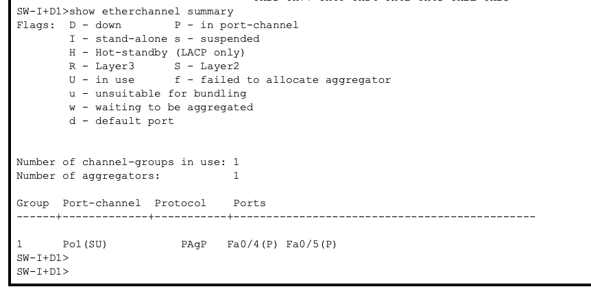
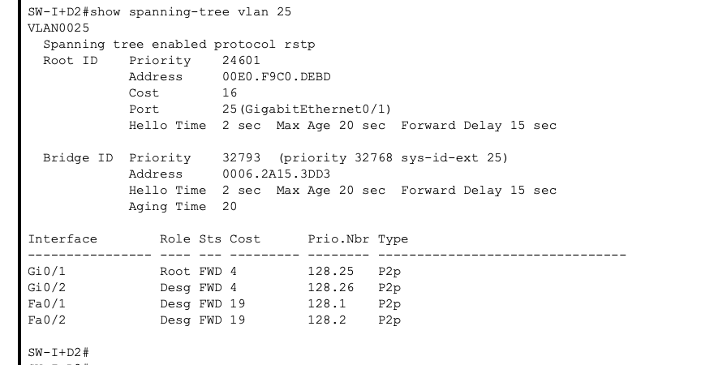
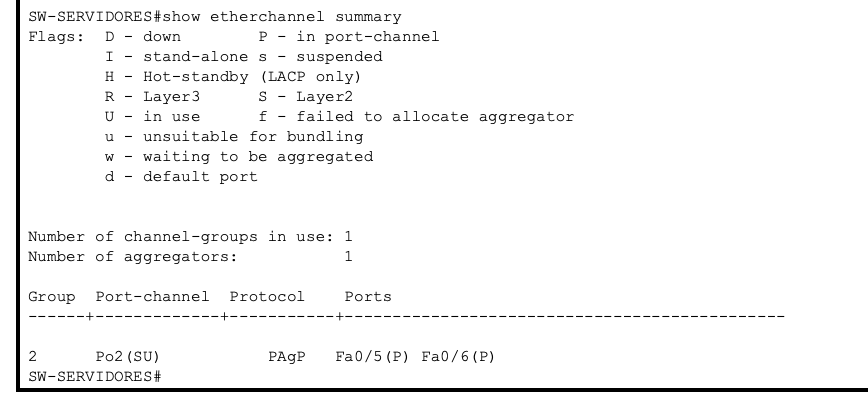
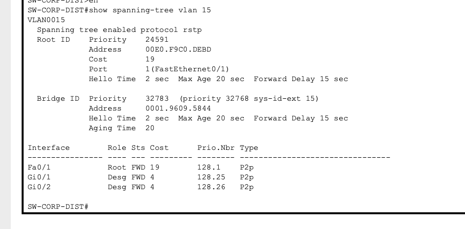

# Proyecto 1 - SmartCity Tech Park

## Redes de Computadoras 1

**Universidad de San Carlos de Guatemala**  
**Facultad de Ingeniería**  
**Ingeniería en Ciencias y Sistemas**

---

## Datos del estudiante

- **Proyecto:** SmartCity Tech Park
- **Nombre:** Astrid Vanesa Kim Ortiz
- **Carné:** 202300685
- **Curso:** Redes de Computadoras 1
- **Semestre:** Segundo Semestre 2026
- **Herramienta utilizada:** Cisco Packet Tracer 8.x o superior

---

# 1. Introducción

El proyecto **SmartCity Tech Park** consiste en el diseño e implementación de una red LAN corporativa orientada principalmente a las capas 1 y 2 del modelo OSI.

La infraestructura fue dividida en diferentes áreas con el propósito de evitar una red plana, reducir el tamaño de los dominios de broadcast, separar el tráfico de los distintos departamentos y proporcionar redundancia en las zonas críticas.

Para cumplir estos objetivos se utilizaron las siguientes tecnologías:

- VLANs.
- VTP.
- Enlaces Trunk IEEE 802.1Q.
- Rapid-PVST.
- EtherChannel mediante PAgP.
- Puertos Access.
- Access Point para visitantes.
- Segmento Legacy mediante HUB.
- Redundancia física entre switches.
- Direccionamiento IPv4 estático para las pruebas de conectividad.

El diseño garantiza comunicación **intra-VLAN** entre los dispositivos que pertenecen al mismo segmento y mantiene aislamiento **inter-VLAN**, debido a que no se implementó routing entre VLANs.

No se utilizaron routers, Router-on-a-Stick, interfaces SVI para enrutamiento, protocolos de routing, ACL ni DHCP, ya que el alcance del proyecto se centra en conmutación de Capa 2.

---

# 2. Objetivos

## 2.1 Objetivo general

Diseñar e implementar una red jerárquica para el complejo tecnológico SmartCity Tech Park utilizando tecnologías de conmutación de Capa 2 que proporcionen segmentación lógica, administración centralizada, redundancia y prevención de bucles.

## 2.2 Objetivos específicos

- Implementar una topología jerárquica utilizando un switch central.
- Separar los departamentos mediante VLANs.
- Administrar las VLANs mediante VTP.
- Configurar enlaces Trunk entre switches.
- Utilizar una VLAN nativa diferente de VLAN 1.
- Implementar EtherChannel donde exista necesidad de mayor capacidad y redundancia.
- Utilizar Rapid-PVST para prevenir loops de Capa 2.
- Proporcionar redundancia en el Centro de I+D.
- Proporcionar redundancia entre las dos alas del Edificio Corporativo.
- Implementar un segmento Legacy utilizando un HUB.
- Proporcionar conectividad inalámbrica a los visitantes mediante un Access Point.
- Mantener a los visitantes aislados de las demás VLANs.
- Comprobar conectividad intra-VLAN mediante pruebas de ping.
- Comprobar aislamiento inter-VLAN mediante pruebas de ping fallidas.

---

# 3. Parámetros determinados por el carné

El número de carné utilizado es:

```text
202300685
```

Los valores relevantes son:

- Último dígito: **5**
- Penúltimo dígito: **8**
- El carné termina en un número **impar**

Por lo tanto, los parámetros utilizados son:

| Parámetro | Configuración |
|---|---|
| Dominio VTP | `Smart_8` |
| Contraseña VTP | `proyecto12S2026` |
| EtherChannel | PAgP |
| STP | Rapid-PVST |
| VLAN nativa | 95 |
| Banner | `Acceso Restringido - TechPark_202300685` |

---

# 4. Topología implementada

La red fue dividida en las siguientes áreas:

1. Centro de Datos / Core.
2. Centro de Investigación y Desarrollo.
3. Edificio Corporativo.
4. Planta de Producción.
5. Área de Servidores.

El dispositivo `SW-CORE` funciona como punto central de la red y como VTP Server.

Desde este equipo se distribuye la conectividad hacia I+D, el Edificio Corporativo, Producción y el área de Servidores.

## Topología completa


---

# 5. VLANs utilizadas

Las VLANs fueron determinadas con base en el último dígito del carné.

| VLAN | Nombre | Área principal | Función |
|---:|---|---|---|
| 15 | GERENCIA | Edificio Corporativo | PCs administrativas |
| 25 | INVESTIGACION | Centro de I+D | Estaciones de investigación |
| 35 | PRODUCCION | Planta de Producción | Máquinas y PCs del segmento Legacy |
| 45 | SERVIDORES | Centro de Datos | Granja de servidores |
| 55 | VISITANTES | Edificio Corporativo | Laptops inalámbricas de invitados |
| 95 | VLAN0095 | Enlaces Trunk | VLAN nativa |

Las VLANs 15, 25, 35, 45, 55 y 95 fueron creadas en `SW-CORE`.

Los switches configurados como VTP Client aprendieron estas VLANs mediante VTP, por lo que no fue necesario crearlas manualmente en cada switch.

---

# 6. VTP

## 6.1 Configuración utilizada

Dominio:

```text
Smart_8
```

Contraseña:

```text
proyecto12S2026
```

Servidor VTP:

```text
SW-CORE
```

Modo:

```text
VTP Server
```

Los switches del campus fueron configurados como clientes:

```text
VTP Client
```

## 6.2 Justificación del VTP Server

Se seleccionó `SW-CORE` como VTP Server porque se encuentra en el Centro de Datos y constituye el núcleo lógico de la infraestructura.

Centralizar la administración de VLANs permite realizar los cambios desde un único dispositivo y distribuir la base de datos de VLANs a los switches clientes.

Por ejemplo, la VLAN:

```text
25 INVESTIGACION
```

se creó en `SW-CORE` y posteriormente fue aprendida por `SW-I+D1`, `SW-I+D2` y `SW-I+D3`.

Los dispositivos finales, el Access Point y el HUB no participan en VTP.

## 6.3 Aislamiento de visitantes respecto a la administración de VLANs

Los visitantes se conectan únicamente mediante el Access Point conectado al puerto `Fa0/1` de `ALA-B`.

Este puerto trabaja como **Access VLAN 55**, por lo que las laptops de visitantes no tienen acceso a enlaces Trunk ni participan en VTP. VTP se mantiene como un mecanismo de control entre switches, mientras que los dispositivos visitantes únicamente generan tráfico de usuario dentro de VLAN 55.

## Evidencia

```text
show vtp status
```


```text
show vtp status
```


---

# 7. Tabla de dispositivos y roles

| Dispositivo | Área | Rol | VTP | VLAN principal |
|---|---|---|---|---|
| SW-CORE | Centro de Datos | Core | Server | Todas |
| SW-SERVIDORES | Centro de Datos | Acceso de servidores | Client | 45 |
| SW-I+D1 | Investigación | Distribución | Client | 25 |
| SW-I+D2 | Investigación | Acceso | Client | 25 |
| SW-I+D3 | Investigación | Acceso | Client | 25 |
| SW-CORP-DIST | Corporativo | Distribución | Client | 15 y 55 |
| ALA-A | Corporativo | Acceso | Client | 15 |
| ALA-B | Corporativo | Acceso | Client | 15 y 55 |
| SW-PRODUCCION | Producción | Distribución/Acceso | Client | 35 |
| AccessPoint-PT | Visitantes | Acceso inalámbrico | No aplica | 55 |
| HUB | Producción | Segmento Legacy | No aplica | 35 |
| Server0-Server3 | Centro de Datos | Dispositivos finales | No aplica | 45 |

---

# 8. Asignación de puertos

## 8.1 SW-CORE

| Puerto | Conectado a | Tipo | VLANs |
|---|---|---|---|
| Fa0/1 | SW-I+D1 Fa0/5 | EtherChannel Po1 / Trunk | 25,95 |
| Fa0/3 | SW-I+D1 Fa0/4 | EtherChannel Po1 / Trunk | 25,95 |
| Fa0/2 | SW-CORP-DIST Fa0/1 | Trunk | 15,55,95 |
| Fa0/6 | SW-PRODUCCION Fa0/2 | Trunk | 35,95 |
| Fa0/4 | SW-SERVIDORES Fa0/6 | EtherChannel Po2 / Trunk | 45,95 |
| Fa0/5 | SW-SERVIDORES Fa0/5 | EtherChannel Po2 / Trunk | 45,95 |

## 8.2 SW-SERVIDORES

| Puerto | Conectado a | Tipo | VLAN |
|---|---|---|---|
| Fa0/1 | Server0 | Access | 45 |
| Fa0/2 | Server1 | Access | 45 |
| Fa0/3 | Server2 | Access | 45 |
| Fa0/4 | Server3 | Access | 45 |
| Fa0/5 | SW-CORE Fa0/5 | EtherChannel Po2 / Trunk | 45,95 |
| Fa0/6 | SW-CORE Fa0/4 | EtherChannel Po2 / Trunk | 45,95 |

## 8.3 SW-I+D1

| Puerto | Conectado a | Tipo | VLAN |
|---|---|---|---|
| Fa0/1 | PC0 | Access | 25 |
| Fa0/2 | PC1 | Access | 25 |
| Fa0/3 | PC2 | Access | 25 |
| Fa0/4 | SW-CORE Fa0/3 | EtherChannel Po1 / Trunk | 25,95 |
| Fa0/5 | SW-CORE Fa0/1 | EtherChannel Po1 / Trunk | 25,95 |
| Gi0/1 | SW-I+D2 Gi0/1 | Trunk | 25,95 |
| Gi0/2 | SW-I+D3 Gi0/1 | Trunk | 25,95 |

## 8.4 SW-I+D2

| Puerto | Conectado a | Tipo | VLAN |
|---|---|---|---|
| Fa0/1 | Laptop | Access | 25 |
| Fa0/2 | Laptop | Access | 25 |
| Gi0/1 | SW-I+D1 Gi0/1 | Trunk | 25,95 |
| Gi0/2 | SW-I+D3 Gi0/2 | Trunk | 25,95 |

## 8.5 SW-I+D3

| Puerto | Conectado a | Tipo | VLAN |
|---|---|---|---|
| Fa0/1 | PC | Access | 25 |
| Fa0/2 | PC | Access | 25 |
| Fa0/3 | PC | Access | 25 |
| Gi0/1 | SW-I+D1 Gi0/2 | Trunk | 25,95 |
| Gi0/2 | SW-I+D2 Gi0/2 | Trunk | 25,95 |

## 8.6 SW-CORP-DIST

| Puerto | Conectado a | Tipo | VLAN |
|---|---|---|---|
| Fa0/1 | SW-CORE Fa0/2 | Trunk | 15,55,95 |
| Gi0/1 | ALA-A Gi0/1 | Trunk | 15,55,95 |
| Gi0/2 | ALA-B Gi0/1 | Trunk | 15,55,95 |

## 8.7 ALA-A

| Puerto | Conectado a | Tipo | VLAN |
|---|---|---|---|
| Fa0/1 | PC Gerencia | Access | 15 |
| Fa0/2 | PC Gerencia | Access | 15 |
| Fa0/3 | PC Gerencia | Access | 15 |
| Gi0/1 | SW-CORP-DIST Gi0/1 | Trunk | 15,55,95 |
| Gi0/2 | ALA-B Gi0/2 | Trunk | 15,55,95 |

## 8.8 ALA-B

| Puerto | Conectado a | Tipo | VLAN |
|---|---|---|---|
| Fa0/1 | Access Point | Access | 55 |
| Fa0/2 | PC Gerencia | Access | 15 |
| Gi0/1 | SW-CORP-DIST Gi0/2 | Trunk | 15,55,95 |
| Gi0/2 | ALA-A Gi0/2 | Trunk | 15,55,95 |

## 8.9 SW-PRODUCCION

| Puerto | Conectado a | Tipo | VLAN |
|---|---|---|---|
| Fa0/1 | HUB | Access | 35 |
| Fa0/2 | SW-CORE Fa0/6 | Trunk | 35,95 |

---

# 9. Enlaces Trunk

Los enlaces entre switches que requieren transportar una o más VLANs se configuraron en modo Trunk.

Configuración general:

```text
switchport mode trunk
switchport trunk native vlan 95
switchport trunk allowed vlan ...
```

La VLAN nativa utilizada fue:

```text
95
```

en lugar de VLAN 1.

## 9.1 Justificación de la VLAN nativa 95

La VLAN 95 corresponde al esquema `9X`, donde `X` es el último dígito del carné.

Utilizar una VLAN nativa diferente de VLAN 1 permite separar el tráfico nativo del valor predeterminado del switch y cumple con los requerimientos del proyecto.

La VLAN nativa debe ser la misma en ambos extremos de cada Trunk.

Durante la implementación, una diferencia entre ambos extremos produjo el mensaje:

```text
%CDP-4-NATIVE_VLAN_MISMATCH
```

El problema se solucionó configurando VLAN 95 como VLAN nativa en ambos lados del enlace.

## Evidencia

```text
show interfaces trunk
```


---

# 10. EtherChannel

Se configuraron dos EtherChannel principales.

## 10.1 Po1 - Centro de I+D

Enlaces físicos:

```text
SW-CORE Fa0/1 ↔ SW-I+D1 Fa0/5
SW-CORE Fa0/3 ↔ SW-I+D1 Fa0/4
```

Ambos enlaces forman:

```text
Port-channel 1
```

Protocolo:

```text
PAgP
```

El CORE utiliza:

```text
desirable
```

y `SW-I+D1` utiliza:

```text
auto
```

### Justificación

El Centro de I+D requiere un enlace de mayor capacidad hacia el CORE.

El EtherChannel permite que dos enlaces físicos se comporten como un único enlace lógico, proporcionando mayor capacidad agregada y redundancia.

Además, STP analiza el Port-Channel como un solo enlace lógico y no bloquea uno de los enlaces miembros únicamente por existir paralelismo físico.

## 10.2 Po2 - Servidores

Enlaces:

```text
SW-CORE Fa0/4 ↔ SW-SERVIDORES Fa0/6
SW-CORE Fa0/5 ↔ SW-SERVIDORES Fa0/5
```

Estos enlaces forman:

```text
Port-channel 2
```

Protocolo:

```text
PAgP
```

### Justificación

La granja de servidores concentra tráfico crítico y no debe depender de una sola conexión física.

Si uno de los enlaces del Port-Channel falla, el otro enlace puede continuar transportando tráfico, manteniendo conectividad.

## 10.3 Modos PAgP

`desirable` inicia activamente la negociación PAgP.

`auto` espera que el otro extremo inicie la negociación.

La combinación utilizada fue:

```text
desirable + auto
```

La combinación `auto + auto` no se utilizó porque ninguno de los extremos iniciaría la formación del canal.

## Evidencia

```text
show etherchannel summary
```


En una operación correcta se espera observar:

```text
Po1(SU)
Po2(SU)
```

Donde:

- `S` = Port-Channel de Capa 2.
- `U` = enlace en uso.
- `(P)` en los puertos físicos = puerto correctamente agregado al Port-Channel.

---

# 11. Rapid-PVST

Debido a que el carné termina en un número impar, se utilizó:

```text
Rapid-PVST
```

Configuración:

```text
spanning-tree mode rapid-pvst
```

Rapid-PVST se utiliza para prevenir loops de Capa 2 cuando existen enlaces redundantes.

Cada VLAN posee su propia instancia de spanning tree, lo cual permite analizar la topología de forma independiente por VLAN.

---

# 12. Root Bridge

Se seleccionó `SW-CORE` como Root Bridge principal para las VLAN configuradas.

Configuración:

```text
spanning-tree vlan 15,25,35,45,55,95 root primary
```

## 12.1 Justificación

`SW-CORE` se encuentra en el centro lógico de la topología y conecta directamente las áreas principales.

Seleccionarlo intencionalmente como Root Bridge evita que un switch de acceso se convierta en raíz únicamente por poseer un Bridge ID menor.

La decisión hace que la estructura lógica de STP se oriente hacia el núcleo de la red.

## 12.2 Conceptos principales

- **Root ID:** identifica al switch elegido como Root Bridge.
- **Bridge ID:** identifica al switch local.
- **Root Port:** mejor puerto de un switch no raíz para llegar al Root Bridge.
- **Designated Port:** puerto encargado de reenviar tráfico en un segmento.
- **Alternate Port:** camino redundante que permanece en estado de respaldo.
- **Forwarding:** el puerto puede reenviar tráfico.
- **Discarding:** el puerto evita reenviar tráfico para impedir un loop.

---

# 13. Redundancia en I+D

El Centro de Investigación y Desarrollo posee:

- `SW-I+D1`
- `SW-I+D2`
- `SW-I+D3`

Los tres switches se encuentran interconectados formando una topología triangular.

```text
              SW-I+D1
              /     \
             /       \
       SW-I+D2 ----- SW-I+D3
```

Sin STP, esta estructura podría producir un loop de Capa 2 y una tormenta de broadcast.

Rapid-PVST mantiene uno de los caminos redundantes como respaldo cuando es necesario.

Un puerto puede aparecer como:

```text
Alternate
Discarding
```

Este comportamiento es correcto y no representa una falla.

Si un enlace principal se desconecta, Rapid-PVST puede habilitar el camino alternativo y recuperar la conectividad.

## 13.1 Estaciones

I+D cuenta con:

- 3 PCs conectadas a `SW-I+D1`.
- 2 laptops conectadas a `SW-I+D2`.
- 3 PCs conectadas a `SW-I+D3`.

Total:

```text
8 estaciones
```

## Evidencia

Triángulo de I+D:


```text
show spanning-tree vlan 25
```


---

# 14. Edificio Corporativo

El Edificio Corporativo posee:

- `SW-CORP-DIST`
- `ALA-A`
- `ALA-B`

La estructura implementada es:

```text
             SW-CORP-DIST
              /        \
             /          \
         ALA-A -------- ALA-B
```

El enlace directo entre `ALA-A` y `ALA-B` proporciona redundancia.

Si uno de los enlaces hacia `SW-CORP-DIST` falla, Rapid-PVST puede utilizar el enlace entre ambas alas para mantener la conectividad.

Las VLAN principales del edificio son:

- VLAN 15 `GERENCIA`
- VLAN 55 `VISITANTES`

---

# 15. Gerencia

Las PCs administrativas pertenecen a:

```text
VLAN 15 GERENCIA
```

Distribución:

- 3 PCs en `ALA-A`.
- 1 PC en `ALA-B`.

Las cuatro PCs pueden comunicarse entre sí porque pertenecen a la misma VLAN y a la misma red IP.

---

# 16. Visitantes

Los visitantes pertenecen a:

```text
VLAN 55 VISITANTES
```

Se utilizó un:

```text
AccessPoint-PT
```

con dos laptops inalámbricas.

El Access Point se conecta a:

```text
ALA-B Fa0/1
```

El puerto fue configurado como:

```text
switchport mode access
switchport access vlan 55
spanning-tree portfast
```

Por lo tanto, todo el tráfico cableado que sale del Access Point hacia `ALA-B` pertenece a VLAN 55.

## 16.1 Configuración inalámbrica asumida

Para identificar la red inalámbrica se utilizó:

```text
SSID: TechPark_Visitantes
```

Seguridad:

```text
WPA2-PSK
```

Clave utilizada:

```text
TechPark2026
```

Las dos laptops se asocian al mismo SSID y utilizan direcciones IPv4 estáticas de la red `192.168.55.0/24`.

## 16.2 Aislamiento

Los visitantes pueden comunicarse entre sí dentro de VLAN 55, pero no pueden comunicarse directamente con:

- VLAN 15 GERENCIA.
- VLAN 25 INVESTIGACION.
- VLAN 35 PRODUCCION.
- VLAN 45 SERVIDORES.

La razón es que no existe routing inter-VLAN.

---

# 17. Planta de Producción y segmento Legacy

La Planta de Producción utiliza la estructura:

```text
SW-PRODUCCION → HUB → PCs/Máquinas
```

Todos los dispositivos conectados al HUB pertenecen a:

```text
VLAN 35 PRODUCCION
```

El puerto del switch hacia el HUB es:

```text
SW-PRODUCCION Fa0/1
```

y fue configurado como:

```text
switchport mode access
switchport access vlan 35
```

---

# 18. Dominio de colisión Legacy

Un HUB trabaja en Capa 1.

Cuando recibe una señal por uno de sus puertos, la replica hacia los demás puertos.

Por lo tanto, todos los dispositivos conectados al HUB comparten el mismo medio lógico y forman **un único dominio de colisión compartido**.

En este proyecto, el segmento:

```text
SW-PRODUCCION Fa0/1 ↔ HUB ↔ 4 equipos
```

representa un solo dominio de colisión compartido.

El HUB se mantuvo intencionalmente porque forma parte del requisito de infraestructura Legacy y permite demostrar la diferencia entre un medio compartido y una red conmutada moderna.

---

# 19. Dominios de broadcast

Cada VLAN configurada constituye un dominio de broadcast independiente.

| VLAN | Nombre | Dominio de broadcast |
|---:|---|---:|
| 15 | GERENCIA | 1 |
| 25 | INVESTIGACION | 1 |
| 35 | PRODUCCION | 1 |
| 45 | SERVIDORES | 1 |
| 55 | VISITANTES | 1 |
| 95 | VLAN nativa | 1 |

**Total de dominios de broadcast configurados: 6.**

La VLAN 95 no contiene dispositivos finales, pero sigue siendo una VLAN activa y constituye un dominio de broadcast independiente.

La VLAN 1 permanece como VLAN predeterminada de Cisco en puertos no utilizados, pero no forma parte del diseño lógico de usuarios del proyecto ni se permite por los trunks configurados.

---

# 20. Dominios de colisión

En una red conmutada, cada enlace Ethernet físico conectado a un puerto de switch constituye un dominio de colisión independiente. En enlaces full-duplex no se producen colisiones en operación normal, pero físicamente continúan siendo segmentos independientes.

Los miembros físicos de un EtherChannel también son enlaces físicos independientes, aunque lógicamente sean administrados como un Port-Channel.

## 20.1 Puertos activos por switch

| Switch | Puertos físicos activos | Dominios asociados localmente |
|---|---:|---:|
| SW-CORE | 6 | 6 |
| SW-SERVIDORES | 6 | 6 |
| SW-I+D1 | 7 | 7 |
| SW-I+D2 | 4 | 4 |
| SW-I+D3 | 5 | 5 |
| SW-CORP-DIST | 3 | 3 |
| ALA-A | 5 | 5 |
| ALA-B | 4 | 4 |
| SW-PRODUCCION | 2 | 2 |

La suma de puertos activos de los switches es 42, pero los enlaces switch-switch aparecen en ambos extremos y no deben contarse dos veces al calcular segmentos físicos únicos.

## 20.2 Conteo de segmentos físicos únicos

- Enlaces físicos entre switches: **12**
- Enlaces cableados hacia dispositivos finales y AP: **17**
- Segmento compartido `SW-PRODUCCION ↔ HUB ↔ 4 equipos`: **1**

**Total de dominios de colisión Ethernet físicos únicos: 30.**

De estos 30 dominios, **1 es compartido**, correspondiente al HUB de Producción.

La red inalámbrica del Access Point utiliza un medio compartido de radiofrecuencia y se considera un dominio de contención inalámbrico; no se contabiliza como un dominio de colisión Ethernet CSMA/CD.

---

# 21. Direccionamiento IP

Se utilizó una red `/24` diferente para cada VLAN de usuarios.

| VLAN | Red | Máscara |
|---:|---|---|
| 15 | `192.168.15.0/24` | `255.255.255.0` |
| 25 | `192.168.25.0/24` | `255.255.255.0` |
| 35 | `192.168.35.0/24` | `255.255.255.0` |
| 45 | `192.168.45.0/24` | `255.255.255.0` |
| 55 | `192.168.55.0/24` | `255.255.255.0` |

No se configuró Default Gateway en los dispositivos finales porque no existe routing inter-VLAN.

---

# 22. Direcciones IP utilizadas

## VLAN 15 - GERENCIA

| Dispositivo | IP | Máscara | Gateway |
|---|---|---|---|
| ALA-A PC1 | 192.168.15.10 | 255.255.255.0 | No configurado |
| ALA-A PC2 | 192.168.15.11 | 255.255.255.0 | No configurado |
| ALA-A PC3 | 192.168.15.12 | 255.255.255.0 | No configurado |
| ALA-B PC | 192.168.15.13 | 255.255.255.0 | No configurado |

## VLAN 25 - INVESTIGACION

| Dispositivo | IP | Máscara | Gateway |
|---|---|---|---|
| PC0 | 192.168.25.10 | 255.255.255.0 | No configurado |
| PC1 | 192.168.25.11 | 255.255.255.0 | No configurado |
| PC2 | 192.168.25.12 | 255.255.255.0 | No configurado |
| Laptop 1 | 192.168.25.13 | 255.255.255.0 | No configurado |
| Laptop 2 | 192.168.25.14 | 255.255.255.0 | No configurado |
| PC SW-I+D3 #1 | 192.168.25.15 | 255.255.255.0 | No configurado |
| PC SW-I+D3 #2 | 192.168.25.16 | 255.255.255.0 | No configurado |
| PC SW-I+D3 #3 | 192.168.25.17 | 255.255.255.0 | No configurado |

## VLAN 35 - PRODUCCION

| Dispositivo | IP | Máscara | Gateway |
|---|---|---|---|
| Máquina/PC 1 | 192.168.35.10 | 255.255.255.0 | No configurado |
| Máquina/PC 2 | 192.168.35.11 | 255.255.255.0 | No configurado |
| Máquina/PC 3 | 192.168.35.12 | 255.255.255.0 | No configurado |
| Máquina/PC 4 | 192.168.35.13 | 255.255.255.0 | No configurado |

## VLAN 45 - SERVIDORES

| Dispositivo | IP | Máscara | Gateway |
|---|---|---|---|
| Server0 | 192.168.45.10 | 255.255.255.0 | No configurado |
| Server1 | 192.168.45.11 | 255.255.255.0 | No configurado |
| Server2 | 192.168.45.12 | 255.255.255.0 | No configurado |
| Server3 | 192.168.45.13 | 255.255.255.0 | No configurado |

## VLAN 55 - VISITANTES

| Dispositivo | IP | Máscara | Gateway |
|---|---|---|---|
| Laptop Visitante 1 | 192.168.55.10 | 255.255.255.0 | No configurado |
| Laptop Visitante 2 | 192.168.55.11 | 255.255.255.0 | No configurado |

---

# 23. Pruebas de conectividad

El objetivo de las pruebas fue comprobar:

```text
Conectividad intra-VLAN
```

y:

```text
Aislamiento inter-VLAN
```

## 23.1 Pruebas intra-VLAN

| Origen | Destino | VLAN | Resultado esperado |
|---|---|---:|---|
| 192.168.15.10 | 192.168.15.11 | 15 | SUCCESS |
| 192.168.15.10 | 192.168.15.13 | 15 | SUCCESS |
| 192.168.25.10 | 192.168.25.17 | 25 | SUCCESS |
| 192.168.35.10 | 192.168.35.13 | 35 | SUCCESS |
| 192.168.45.10 | 192.168.45.11 | 45 | SUCCESS |
| 192.168.55.10 | 192.168.55.11 | 55 | SUCCESS |

Los primeros paquetes pueden requerir resolución ARP antes de que el ping se estabilice.

## 23.2 Pruebas inter-VLAN

| Origen | Destino | VLAN origen → destino | Resultado esperado |
|---|---|---|---|
| 192.168.55.10 | 192.168.15.10 | 55 → 15 | FAILED |
| 192.168.25.10 | 192.168.35.10 | 25 → 35 | FAILED |
| 192.168.15.10 | 192.168.45.10 | 15 → 45 | FAILED |
| 192.168.35.10 | 192.168.55.10 | 35 → 55 | FAILED |

El fallo es intencional porque no existe un dispositivo de Capa 3 realizando routing entre estas redes.

---

# 24. Seguridad básica

En los switches de distribución se configuró el banner:

```text
Acceso Restringido - TechPark_202300685
```

Comando:

```text
banner motd #Acceso Restringido - TechPark_202300685#
```

El banner funciona como una advertencia visible al acceder a la consola del dispositivo.

Se aplicó en los switches que desempeñan funciones de distribución:

- `SW-I+D1`
- `SW-CORP-DIST`
- `SW-PRODUCCION`

---

# 25. Medios de transmisión

Para la implementación simulada se asumieron distancias inferiores a 100 metros entre los dispositivos conectados mediante Ethernet, por lo que se utilizó cableado de cobre UTP categoría 6.

El uso de FastEthernet y GigabitEthernet en la topología permite justificar esta selección dentro de un entorno de campus compacto.

| Enlace | Medio utilizado | Justificación |
|---|---|---|
| CORE ↔ I+D | UTP Cat6, dos enlaces | Se agregan mediante EtherChannel para aumentar capacidad y redundancia |
| CORE ↔ Corporativo | UTP Cat6 | Enlace Trunk entre Core y distribución |
| CORE ↔ Producción | UTP Cat6 | Enlace Trunk para VLAN 35 |
| CORE ↔ Servidores | UTP Cat6, dos enlaces | EtherChannel para capacidad y tolerancia a fallos |
| SW-I+D1 ↔ SW-I+D2 | UTP Cat6 GigabitEthernet | Enlace Trunk de alta velocidad |
| SW-I+D1 ↔ SW-I+D3 | UTP Cat6 GigabitEthernet | Enlace Trunk redundante |
| SW-I+D2 ↔ SW-I+D3 | UTP Cat6 GigabitEthernet | Camino alternativo para STP |
| SW-CORP-DIST ↔ ALA-A | UTP Cat6 GigabitEthernet | Distribución hacia ala de acceso |
| SW-CORP-DIST ↔ ALA-B | UTP Cat6 GigabitEthernet | Distribución hacia ala de acceso |
| ALA-A ↔ ALA-B | UTP Cat6 GigabitEthernet | Redundancia entre alas |
| Switch ↔ PC/Servidor | UTP Cat6 | Distancias cortas y conexión de dispositivo final |
| SW-PRODUCCION ↔ HUB | UTP Cat6 | Integración del segmento Legacy |
| HUB ↔ PCs/Máquinas | UTP Cat6 | Segmento compartido de Capa 1 |
| ALA-B ↔ Access Point | UTP Cat6 | Uplink Ethernet del AP |
| Access Point ↔ Laptops | IEEE 802.11 inalámbrico | Acceso de visitantes sin cableado |

No se utilizaron enlaces de fibra óptica ni módulos SFP en la implementación final debido a que se asumieron distancias compatibles con UTP Cat6. La mayor demanda de ancho de banda hacia I+D y Servidores se resolvió mediante EtherChannel.

---

# 26. Configuración por dispositivo

## 26.1 SW-CORE

```text
enable
configure terminal

hostname SW-CORE

vtp domain Smart_8
vtp password proyecto12S2026
vtp mode server

vlan 15
 name GERENCIA
exit
vlan 25
 name INVESTIGACION
exit
vlan 35
 name PRODUCCION
exit
vlan 45
 name SERVIDORES
exit
vlan 55
 name VISITANTES
exit
vlan 95
exit

spanning-tree mode rapid-pvst
spanning-tree vlan 15,25,35,45,55,95 root primary

interface fa0/1
 switchport mode trunk
 switchport trunk native vlan 95
 switchport trunk allowed vlan 25,95
 channel-group 1 mode desirable
exit

interface fa0/3
 switchport mode trunk
 switchport trunk native vlan 95
 switchport trunk allowed vlan 25,95
 channel-group 1 mode desirable
exit

interface port-channel 1
 switchport mode trunk
 switchport trunk native vlan 95
 switchport trunk allowed vlan 25,95
exit

interface fa0/2
 switchport mode trunk
 switchport trunk native vlan 95
 switchport trunk allowed vlan 15,55,95
exit

interface fa0/4
 switchport mode trunk
 switchport trunk native vlan 95
 switchport trunk allowed vlan 45,95
 channel-group 2 mode desirable
exit

interface fa0/5
 switchport mode trunk
 switchport trunk native vlan 95
 switchport trunk allowed vlan 45,95
 channel-group 2 mode desirable
exit

interface port-channel 2
 switchport mode trunk
 switchport trunk native vlan 95
 switchport trunk allowed vlan 45,95
exit

interface fa0/6
 switchport mode trunk
 switchport trunk native vlan 95
 switchport trunk allowed vlan 35,95
exit

end
write memory
```

## 26.2 SW-SERVIDORES

```text
enable
configure terminal

hostname SW-SERVIDORES

vtp domain Smart_8
vtp password proyecto12S2026
vtp mode client

spanning-tree mode rapid-pvst

interface fa0/5
 switchport mode trunk
 switchport trunk native vlan 95
 switchport trunk allowed vlan 45,95
 channel-group 2 mode auto
exit

interface fa0/6
 switchport mode trunk
 switchport trunk native vlan 95
 switchport trunk allowed vlan 45,95
 channel-group 2 mode auto
exit

interface port-channel 2
 switchport mode trunk
 switchport trunk native vlan 95
 switchport trunk allowed vlan 45,95
exit

interface range fa0/1 - 4
 switchport mode access
 switchport access vlan 45
 spanning-tree portfast
exit

end
write memory
```

## 26.3 SW-I+D1

```text
enable
configure terminal

hostname SW-I+D1

vtp domain Smart_8
vtp password proyecto12S2026
vtp mode client

spanning-tree mode rapid-pvst

banner motd #Acceso Restringido - TechPark_202300685#

interface fa0/4
 switchport mode trunk
 switchport trunk native vlan 95
 switchport trunk allowed vlan 25,95
 channel-group 1 mode auto
exit

interface fa0/5
 switchport mode trunk
 switchport trunk native vlan 95
 switchport trunk allowed vlan 25,95
 channel-group 1 mode auto
exit

interface port-channel 1
 switchport mode trunk
 switchport trunk native vlan 95
 switchport trunk allowed vlan 25,95
exit

interface gi0/1
 switchport mode trunk
 switchport trunk native vlan 95
 switchport trunk allowed vlan 25,95
exit

interface gi0/2
 switchport mode trunk
 switchport trunk native vlan 95
 switchport trunk allowed vlan 25,95
exit

interface range fa0/1 - 3
 switchport mode access
 switchport access vlan 25
 spanning-tree portfast
exit

end
write memory
```

## 26.4 SW-I+D2

```text
enable
configure terminal

hostname SW-I+D2

vtp domain Smart_8
vtp password proyecto12S2026
vtp mode client

spanning-tree mode rapid-pvst

interface gi0/1
 switchport mode trunk
 switchport trunk native vlan 95
 switchport trunk allowed vlan 25,95
exit

interface gi0/2
 switchport mode trunk
 switchport trunk native vlan 95
 switchport trunk allowed vlan 25,95
exit

interface range fa0/1 - 2
 switchport mode access
 switchport access vlan 25
 spanning-tree portfast
exit

end
write memory
```

## 26.5 SW-I+D3

```text
enable
configure terminal

hostname SW-I+D3

vtp domain Smart_8
vtp password proyecto12S2026
vtp mode client

spanning-tree mode rapid-pvst

interface gi0/1
 switchport mode trunk
 switchport trunk native vlan 95
 switchport trunk allowed vlan 25,95
exit

interface gi0/2
 switchport mode trunk
 switchport trunk native vlan 95
 switchport trunk allowed vlan 25,95
exit

interface range fa0/1 - 3
 switchport mode access
 switchport access vlan 25
 spanning-tree portfast
exit

end
write memory
```

## 26.6 SW-CORP-DIST

```text
enable
configure terminal

hostname SW-CORP-DIST

vtp domain Smart_8
vtp password proyecto12S2026
vtp mode client

spanning-tree mode rapid-pvst

banner motd #Acceso Restringido - TechPark_202300685#

interface fa0/1
 switchport mode trunk
 switchport trunk native vlan 95
 switchport trunk allowed vlan 15,55,95
exit

interface gi0/1
 switchport mode trunk
 switchport trunk native vlan 95
 switchport trunk allowed vlan 15,55,95
exit

interface gi0/2
 switchport mode trunk
 switchport trunk native vlan 95
 switchport trunk allowed vlan 15,55,95
exit

end
write memory
```

## 26.7 ALA-A

```text
enable
configure terminal

hostname ALA-A

vtp domain Smart_8
vtp password proyecto12S2026
vtp mode client

spanning-tree mode rapid-pvst

interface gi0/1
 switchport mode trunk
 switchport trunk native vlan 95
 switchport trunk allowed vlan 15,55,95
exit

interface gi0/2
 switchport mode trunk
 switchport trunk native vlan 95
 switchport trunk allowed vlan 15,55,95
exit

interface range fa0/1 - 3
 switchport mode access
 switchport access vlan 15
 spanning-tree portfast
exit

end
write memory
```

## 26.8 ALA-B

```text
enable
configure terminal

hostname ALA-B

vtp domain Smart_8
vtp password proyecto12S2026
vtp mode client

spanning-tree mode rapid-pvst

interface gi0/1
 switchport mode trunk
 switchport trunk native vlan 95
 switchport trunk allowed vlan 15,55,95
exit

interface gi0/2
 switchport mode trunk
 switchport trunk native vlan 95
 switchport trunk allowed vlan 15,55,95
exit

interface fa0/1
 switchport mode access
 switchport access vlan 55
 spanning-tree portfast
exit

interface fa0/2
 switchport mode access
 switchport access vlan 15
 spanning-tree portfast
exit

end
write memory
```

## 26.9 SW-PRODUCCION

```text
enable
configure terminal

hostname SW-PRODUCCION

vtp domain Smart_8
vtp password proyecto12S2026
vtp mode client

spanning-tree mode rapid-pvst

banner motd #Acceso Restringido - TechPark_202300685#

interface fa0/2
 switchport mode trunk
 switchport trunk native vlan 95
 switchport trunk allowed vlan 35,95
exit

interface fa0/1
 switchport mode access
 switchport access vlan 35
exit

end
write memory
```

---

# 27. Comandos de verificación utilizados

## VLANs

```text
show vlan brief
```

Permite verificar:

- VLAN existentes.
- Nombre de las VLAN.
- Estado.
- Puertos Access asignados.

## VTP

```text
show vtp status
```

Permite verificar:

- Dominio VTP.
- Modo Server/Client.
- Versión.
- Configuration Revision.

## Trunks

```text
show interfaces trunk
```

Permite verificar:

- Puertos Trunk.
- Encapsulación.
- VLAN nativa.
- VLANs permitidas.
- VLANs activas.

## EtherChannel

```text
show etherchannel summary
```

Permite verificar:

- Port-Channels.
- Protocolo PAgP.
- Estado del EtherChannel.
- Puertos miembros.

## Spanning Tree

```text
show spanning-tree
```

y:

```text
show spanning-tree vlan 25
```

Permiten verificar:

- Root Bridge.
- Root Ports.
- Designated Ports.
- Alternate Ports.
- Estados Forwarding y Discarding.

## Tabla MAC

```text
show mac address-table
```

Permite observar las direcciones MAC aprendidas dinámicamente.

## Estado físico de interfaces

```text
show interfaces status
```

Permite comprobar:

- Puertos conectados.
- VLAN asignada.
- Velocidad.
- Dúplex.

---

# 28. Capturas de comandos SHOW

## SW-CORE

```text
show spanning-tree
```


```text
show etherchannel summary
```


```text
show interfaces trunk
```


```text
show vtp status
```


```text
show vlan brief
```


---

## SW-I+D1

```text
show etherchannel summary
```



```text
show spanning-tree vlan 25
```



---

## SW-SERVIDORES

```text
show etherchannel summary
```



---

## Edificio Corporativo

SW-CORP-DIST:

```text
show spanning-tree vlan 15
```



---

# 29. Presupuesto estimado

El siguiente presupuesto es una estimación académica en quetzales para representar el costo aproximado de una implementación física equivalente.

Los valores son referenciales y no constituyen una cotización comercial.

| Equipo / material | Cantidad | Precio unitario estimado | Subtotal |
|---|---:|---:|---:|
| Switch Ethernet administrable 24 puertos | 9 | Q650.00 | Q5,850.00 |
| Access Point empresarial básico | 1 | Q450.00 | Q450.00 |
| HUB / equipo Legacy equivalente | 1 | Q250.00 | Q250.00 |
| Servidor físico de entrada | 4 | Q6,000.00 | Q24,000.00 |
| Caja UTP Cat6 de 305 m | 1 | Q950.00 | Q950.00 |
| Patch cords / conectores / terminaciones | 30 | Q35.00 | Q1,050.00 |
| Fibra óptica | 0 | Q0.00 | Q0.00 |
| Módulos SFP de fibra | 0 | Q0.00 | Q0.00 |
| **TOTAL ESTIMADO** |  |  | **Q32,550.00** |

## 29.1 Justificación del presupuesto

Se presupuestaron nueve switches administrables porque la topología utiliza:

1. SW-CORE.
2. SW-SERVIDORES.
3. SW-I+D1.
4. SW-I+D2.
5. SW-I+D3.
6. SW-CORP-DIST.
7. ALA-A.
8. ALA-B.
9. SW-PRODUCCION.

La fibra y los módulos SFP aparecen con cantidad cero debido a que la implementación final asumió distancias compatibles con UTP Cat6.

El HUB representa un equipo Legacy y se incluye únicamente para reflejar físicamente el segmento de Producción requerido.

---

# 30. Pruebas de tolerancia a fallos

Además de las pruebas de ping, la topología permite demostrar tolerancia a fallos en dos áreas.

## 30.1 I+D

Al desconectar uno de los enlaces del triángulo:

```text
SW-I+D1 ↔ SW-I+D2
SW-I+D1 ↔ SW-I+D3
SW-I+D2 ↔ SW-I+D3
```

Rapid-PVST puede cambiar el estado de un puerto alternativo y conservar un camino de comunicación.

## 30.2 Edificio Corporativo

Al desconectar el enlace de una de las alas hacia `SW-CORP-DIST`, el enlace:

```text
ALA-A ↔ ALA-B
```

permite disponer de un camino alternativo.

## 30.3 EtherChannel

Al desconectar uno de los enlaces físicos pertenecientes a `Po1` o `Po2`, el Port-Channel puede mantenerse operativo mediante el enlace restante.

Esto demuestra que EtherChannel no solo proporciona capacidad agregada, sino también tolerancia a fallos de enlace.

---

# 31. Conclusiones

1. La implementación de VLANs permitió separar correctamente las diferentes áreas del SmartCity Tech Park y reducir el alcance de los dominios de broadcast.

2. VTP permitió centralizar la administración de VLANs desde `SW-CORE`, evitando crear manualmente la misma base de datos en cada switch cliente.

3. Rapid-PVST permitió conservar enlaces redundantes en I+D y el Edificio Corporativo sin generar loops de Capa 2.

4. EtherChannel mediante PAgP permitió combinar enlaces físicos en una sola conexión lógica y proporcionar redundancia hacia I+D y Servidores.

5. La selección de `SW-CORE` como Root Bridge permitió controlar de forma intencional la topología lógica de Spanning Tree.

6. La VLAN nativa 95 permitió evitar el uso de VLAN 1 como VLAN nativa en los enlaces Trunk.

7. El segmento Legacy permitió demostrar que un HUB mantiene a todos sus dispositivos dentro de un mismo dominio de colisión compartido.

8. El Access Point permitió proporcionar conectividad inalámbrica a los visitantes manteniéndolos dentro de VLAN 55.

9. La ausencia de routing inter-VLAN permitió comprobar el aislamiento entre departamentos, mientras que los dispositivos pertenecientes a la misma VLAN conservaron conectividad.

10. La topología implementada combina segmentación, redundancia y administración centralizada sin exceder el alcance de Capa 1 y Capa 2 establecido para el proyecto.

---

# 32. Resultado final

La topología implementada cumple con los requerimientos principales de SmartCity Tech Park:

- Topología jerárquica.
- Switch central.
- VTP Server y Clients.
- VLANs basadas en el carné.
- VLAN nativa 95.
- Enlaces Trunk.
- Rapid-PVST.
- Root Bridge definido intencionalmente.
- PAgP.
- Dos EtherChannel.
- Mayor capacidad hacia I+D.
- Redundancia hacia Servidores.
- Tres switches redundantes en I+D.
- Ocho estaciones en I+D.
- Dos alas en el Edificio Corporativo.
- Redundancia entre las alas.
- VLAN 15 para Gerencia.
- VLAN 55 para Visitantes.
- Access Point para visitantes.
- Segmento Legacy mediante HUB.
- VLAN 35 para Producción.
- Cuatro servidores en VLAN 45.
- Conectividad intra-VLAN.
- Aislamiento inter-VLAN.
- Documentación de dominios de broadcast.
- Documentación de dominios de colisión.
- Presupuesto estimado.
- Lista de comandos por dispositivo.
- Evidencias de comandos `show`.

